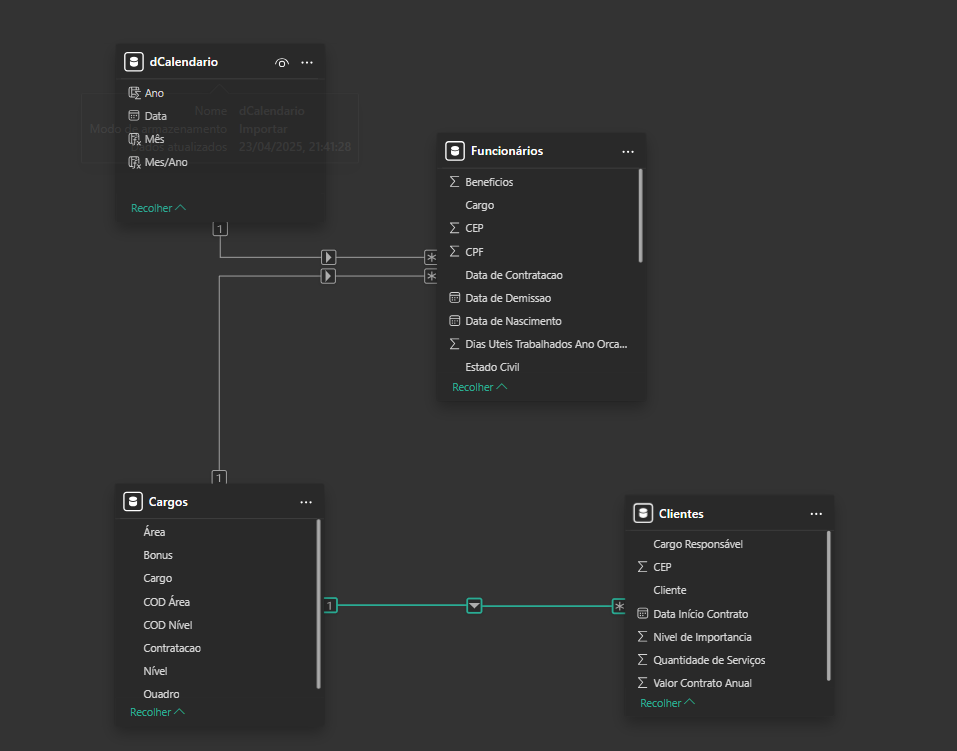
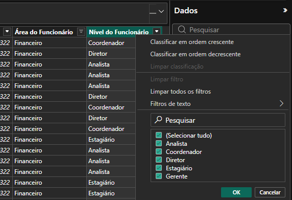
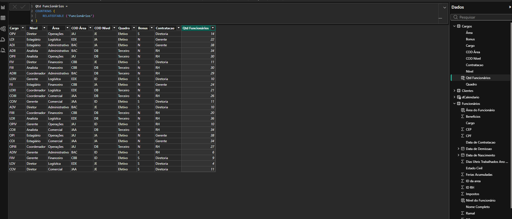

# Colunas Calculadas no Power BI Desktop

Em algumas situações será necessário criar colunas calculadas.

* Preferência é pelas colunas personalizadas no Power Query, são carregadas no modelo de maneira mais compacta.
* Colunas calculadas são recomendadas somente ao adicionar colunas a uma tabela calculada ou quando a fórmulas.

### Exemplo Ano Fiscal

O ano fiscal começa em julho, portanto, as datas de julho a dezembro são atribuídas ao próximo ano civil. A fórmula concatena "FY" com o ano, incrementando o ano em um para datas no segundo semestre do ano.

```dax
Due Fiscal Year =
"FY"
    & YEAR('Due Date'[Due Date])
        + IF(
            MONTH('Due Date'[Due Date]) > 6,
            1
        )
```

### Trimestre Fiscal

Essa coluna atribui um trimestre fiscal a cada data, com base na estrutura do ano fiscal em que o primeiro trimestre é de julho a setembro. A fórmula acrescenta Q e o número do trimestre ao rótulo do ano fiscal.

```DAX
Due Fiscal Quarter =
'Due Date'[Due Fiscal Year] & " Q"
    & IF(
        MONTH('Due Date'[Due Date]) <= 3,
        3,
        IF(
            MONTH('Due Date'[Due Date]) <= 6,
            4,
            IF(
                MONTH('Due Date'[Due Date]) <= 9,
                1,
                2
            )
        )
    )
```

## Função `FORMAT`

A função `FORMAT` converte o valor da coluna em texto usando uma cadeia de caracteres de formato.

```DAX
Nome Mês = FORMAT(D_Calendario[Data], "MMMM")
```
## Funções: `RELATED` e `RELATEDTABLE`

Se existir um relacionamento entre duas tabelas, use a função `RELATED`ou `RELATEDTABLE`

* `RELATED`: obtém valor do lado um de um relacionamento

    * RELATED() → quando você está em uma tabela do lado “muitos” e quer buscar algo do lado “1”

* `RELATEDTABLE`: obtém uma tabelade valores do lado muitos

    * RELATEDTABLE() → quando você está em uma tabela do lado “1” e quer acessar várias linhas do lado “muitos”

## Exemplo

* Funcionários(*)  → Cargos(1): Trazer informações do Cargo para a tabela Funcionários



```DAX
Área do Funcionário =
RELATED ( Cargos[Área] )
```

* Funcionários(*)  → Nível(1): Trazer informações do Nível para a tabela Funcionários

```DAX
Nível do Funcionário =
RELATED ( Cargos[Nível] )
```




## Exemplo `RELATEDTABLE`

Relação: **Cargos(1) ⟶ Funcinários(*)

* Quantidade de funcionários por cargo

```DAX
Qtd Funcionários =
COUNTROWS (
    RELATEDTABLE ( Funcionários )
)
```


* Soma de benefícios por cargo

```DAX
Total Benefícios =
SUMX (
    RELATEDTABLE ( Funcionários ),
    Funcionários[Benefícios]
)
```

* Total de funcionários por cliente

```DAX
Total Funcionários Cliente =
COUNTROWS (
    RELATEDTABLE ( Funcionários )
)
```


