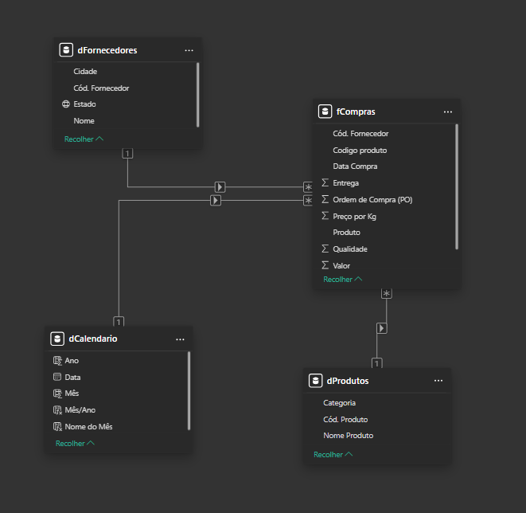

# Análise de Compras - AgroTech Insumos Agrícolas

##  Sobre a Empresa

 A **AgroTech Insumos Agrícolas** é uma empresa especializada na distribuição de insumos para produtores rurais no interior de São Paulo. A empresa comercializa produtos voltados para aumento de produtividade agrícola, divididos em três categorias principais.

## 📦 Portfólio de Produtos

### 🌾 Sementes
- Semente de milho híbrido simples
- Semente de milho híbrido triplo
- Semente de milho variedades

### 🌿 Fertilizantes
- Corretivo de solo
- Macronutriente NPK
- Micronutriente
- Adubo especial

### 🛡 Defensivos Agrícolas
- Fungicida
- Herbicida
- Inseticida
- Adjuvante/Outros

## 🎯 Problemas Identificados pela Diretoria

Nos últimos meses, a empresa percebeu os seguintes desafios:

- 📈 **Aumento no custo total** das compras
- 💰 **Oscilação no preço por Kg** de fertilizantes
- ⚠ **Alta dependência** de alguns fornecedores
- 📅 **Falta de visão clara** por safra e período fiscal
- 🌾 **Crescimento desbalanceado** entre categorias

## 🎯 Objetivo do Projeto no Power BI

Utilizando o modelo estrela com as tabelas:

- `fCompras` (Tabela Fato)
- `dProdutos`
- `dFornecedores`
- `dCalendario`


 empresa deseja responder às seguintes perguntas de negócio:

| Pergunta | Indicador |
|----------|-----------|
| Qual categoria tem maior impacto financeiro? | **Custo total por categoria** |
| O preço médio por Kg está aumentando? | **Preço médio por Kg (série histórica)** |
| Qual fornecedor concentra maior volume? | **Volume de compras por fornecedor** |
| Como está o crescimento por Ano Fiscal? | **Comparação de custos vs ano anterior** |
| Existe sazonalidade nas compras por trimestre fiscal? | **Distribuição das compras ao longo do ano** |
| Qual categoria cresce mais por safra? | **Crescimento percentual por categoria/safra** |


Com este cenário, o projeto permite trabalhar conceitos avançados de análise de dados no Power BI:

- ✅ **Análise por Safra** - períodos específicos do agronegócio
- ✅ **Ano Fiscal diferente do ano civil** - calendário personalizado
- ✅ **Sazonalidade agrícola** - identificação de padrões de compra
- ✅ **Dependência de fornecedores estratégicos** - gestão de risco
- ✅ **Variação de preço por insumo** - análise de volatilidade


## Trabalhando com Medidas

### 🔹Total de Compras

```DAX
Total de Compras =
SUM (fCompras[Valor] )
```

### 🔹 Total Volume Kg

```DAX 
Total de volume Kg =
SUM ( fCompras[Quantidade] )
```

### 🔹 Preço Médio Ponderado

```DAX
Preço Médio Kg =
DIVIDE(
    [Total de Compras],
    [Total de volume Kg]
)
```
* Se volume aumenta → crescimento operacional
* Se preço médio aumenta → problema de negociaç

### 🔹Quantidade de Fornecedores

```DAX
Qtd Fornecedores = COUNTROWS(dFornecedores)
```
### 🔹Quantidade de Categoria
```DAX
Qtd Categoria = DISTINCTCOUNT(dProdutos[Categoria])
```
### 🔹Quantidade de Produtos
```DAX
Qtd Produtos = COUNT(dProdutos[Cód. Produto])
```
### Quantidade de Compras

```DAX
Qtd Compras = COUNTROWS(fCompras)
```

### 🔹Média de Preços
```DAX
Média de preços = AVERAGE(fCompras[Preço por Kg])
```

### 🔹Quantidade de Fornecedores

```DAX
Qtd Fornecedores = COUNTROWS(dFornecedores)
```
### 🔹Total R$ de KG
```DAX
total R$ de Kg = SUM(fCompras[Preço por Kg])
```

| 🔹 Medida                      | 📌 Fórmula DAX                                            | 🎯 O que calcula                  | 🧠 Interpretação Estratégica         |
| ------------------------------ | --------------------------------------------------------- | --------------------------------- | ------------------------------------ |
| **Total de Compras**           | `SUM(fCompras[Valor])`                                    | Soma total financeira das compras | Mede o gasto total da empresa        |
| **Total de Volume Kg**         | `SUM(fCompras[Quantidade])`                               | Soma total de Kg comprados        | Mede crescimento operacional         |
| **Preço Médio Kg (Ponderado)** | `DIVIDE([Total de Compras], [Total de volume Kg])`        | Valor médio real por Kg           | Se aumentar → problema de negociação |
| **Qtd Compras**                | `COUNTROWS(fCompras)`                                     | Total de registros de compras     | Mede volume de pedidos               |
| **Qtd Fornecedores**           | `COUNTROWS(dFornecedores)`                                | Total de fornecedores cadastrados | Mede base ativa de fornecedores      |
| **Qtd Produtos**               | `DISTINCTCOUNT(dProdutos[Cód. Produto])`                  | Total de produtos diferentes      | Mede diversidade de portfólio        |
| **Qtd Categoria**              | `DISTINCTCOUNT(dProdutos[Categoria])`                     | Total de categorias               | Mede variedade estratégica           |
| **Média de Preços (Simples)**  | `AVERAGE(fCompras[Preço por Kg])`                         | Média simples do preço por Kg     | Não considera volume                 |
| **Total R$ por Kg (Correção)** | `DIVIDE(SUM(fCompras[Valor]), SUM(fCompras[Quantidade]))` | Valor financeiro real por Kg      | Forma correta (ponderada)            |

# Funções de Filtro
Modifica o contexto de filtro de uma medida

### Exemplo 1 - Total apenas da categoria Fertilizantes

```DAX
Total Fertilizantes =
CALCULATE(
    [Total de Compras],
    dProdutos[Categoria] = "Fertilizantes"
)
```
### Exemplo 2 – Total do Ano Fiscal Atual
```DAX
Total Ano Fiscal Atual =
CALCULATE(
    [Total de Compras],
    dCalendario[Ano Fiscal] = MAX(dCalendario[Ano Fiscal])
)
```
### Compras acima de R$ 10.000

```DAX

Total Compras Acima 10k =
CALCULATE(
    [Total de Compras],
    FILTER(
        fCompras,
        fCompras[Valor] > 10000
    )
)
```
### – Fornecedores do Estado SP

```DAX
Total SP =
CALCULATE(
    [Total de Compras],
    FILTER(
        dFornecedores,
        dFornecedores[Estado] = "SP"
    )
)
```
### Total Geral (Ignora filtros da página)
```DAX
Total Geral =
CALCULATE(
    [Total de Compras],
    ALL(fCompras)
)
```
### Percentual sobre o Total
```DAX
% Sobre Total =
DIVIDE(
    [Total de Compras],
    CALCULATE(
        [Total de Compras],
        ALL(dFornecedores)
    )
)
```

# Funções Temporais

### TOTALYTD (Year To Date) - Total acumulado no ano.

```DAX
Total YTD =
TOTALYTD(
    [Total de Compras],
    dCalendario[Data]
)
```
### SAMEPERIODLASTYEAR - Compara com mesmo período do ano anterior.

```DAX
Total Ano Anterior =
CALCULATE(
    [Total de Compras],
    SAMEPERIODLASTYEAR(dCalendario[Data])
)
```

### Crescimento Ano vs Ano
```DAX
Crescimento YoY =
DIVIDE(
    [Total de Compras] - [Total Ano Anterior],
    [Total Ano Anterior]
)
```
### DATEADD (Deslocamento de período) - Comparar com mês anterior.

```DAX
Total Mês Anterior =
CALCULATE(
    [Total de Compras],
    DATEADD(dCalendario[Data], -1, MONTH)
)
```
