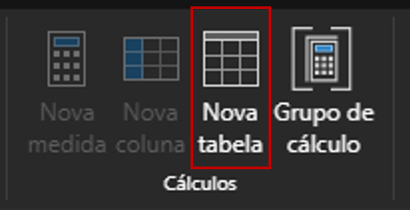
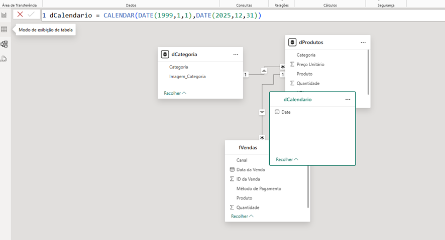
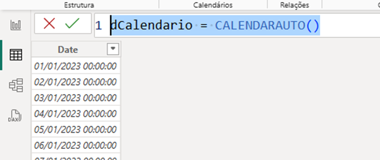
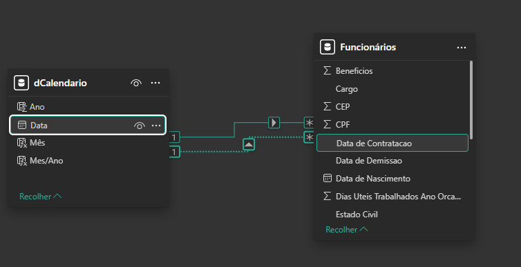
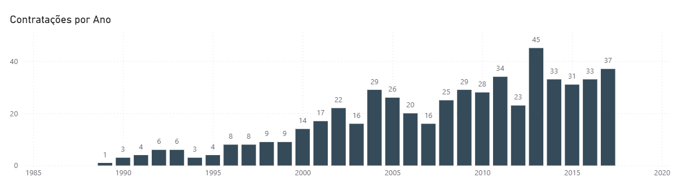
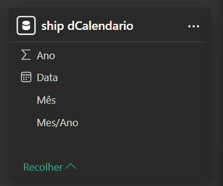
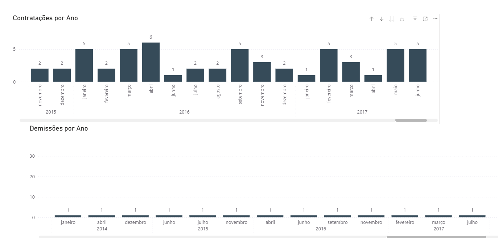
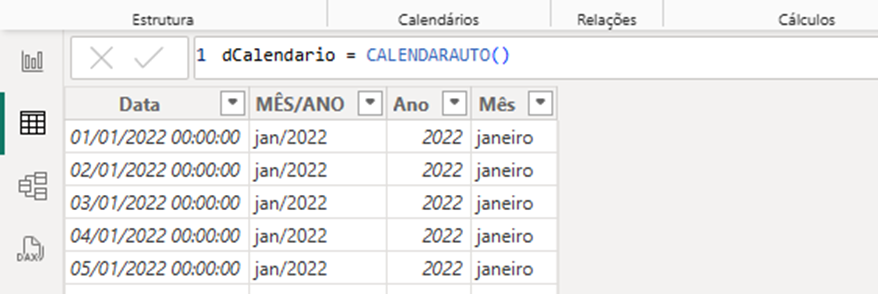

# Tabelas Calculadas no Power BI

A tabela calculada no Power BI permite adicionar novas tabelas com base nos dados carregados no modelo.

O DAX(Data Analysis Expressions), permite adicionar três tipos de cálculos:

1. **Tabelas Calculadas**: permite criar tabelas de data ou dimensões com função múltiplas, ou habilitar análise de teste de hipóteses
2. **Colunas Calculada**: pode ser adicionad a tabelas em seu modelo
3. **Medidas**: realiza os calculos sobre dados do modelo

# Exemplo - Criando tabela de Calendário

A tabela Calendário é uma tabela dimensão que irá conter todas as informações relativas à data: tais como, o ano, o número do mês, o nome do mês, o dia da semana, e quaisquer outras informações que forem relevantes de acordo com a regra de negócio.
Objetivo: filtrar os dados do relatório por meio de qualquer unidade de tempo.
Pode ser criada com a função DAX `CALENDAR` ou `CALENDARAUTO`




## Função CALENDAR

Retorna uma tabela com uma única coluna chamada "Date" que contém um conjunto contíguo de datas. O intervalo de datas é da data de início especificada até a data de término especificada, incluindo essas duas datas.

Exemplo: Criar uma tabela calendário iniciando em 01/01/1999 a 31/12/2025

```dax
dCalendario = CALENDAR(DATE(1999,1,1),DATE(2025,12,31))
```

ou 

```dax
dCalendario =CALENDAR(MIN(F_Vendas[Dt_Venda]),MAX(F_Vendas[Dt_Venda]))
```
Para criar a tabela de Calendário acesse: **Modelagem - Nova Tabela** ou direto na guia de **Exibição de Modelo - Nova Tabela**

* Na barra de formúla digite o nome da tabela seguido do `=`(igual) e a função **CALENDAR** ou **CALENDARAUTO**




## Função CALENDARAUTO()


Retorna uma tabela com uma única coluna chamada "Date" que contém um conjunto contíguo de datas. O intervalo de datas é calculado automaticamente com base nos dados no modelo.

```dax
dCalendario = CALENDARAUTO()
```
A função `CALENDARAUTO` verifica todas as colunas de data e data/hora no modelo, determina as datas mais antigas e mais recentes, e gera o conjunto completo de datas. Passar o **argumento especifica o último mês do ano fiscal**.

#### - Exemplo: Passar o `6`define junho como o fim do ano fiscal.





## Marcar como tabela de datas

Podemos marca uma tabela de datas no Power Bi Desktop. Essa configuração permite que você use funções de inteligência de dados temporais DAX.

## Criando tabelas duplicadas no Power BI Desktop

Imagine uma tabela `Vendas`que armazena dados por **data da ordem**, **data da remessa**, e **data de conclusão**. Isso acaba resultando em três relacionamentos com a tabela `Calendário`.
- Nesse tipo de situação, apenas **um** relacionamento pode estar **ativo** por vez.

Veja outro exemplo a tabela `Funcionários` relaciona-se com a tabela `dCalendario`, através do campo `Data de Contratação`, relacionamento **ativo**. Mais também relaciona-se por `Data de Demissão`este por sua vez fica **desativado**



Nesse caso, a filtragem é feita por `Data de Contratação`e não por `Data de Demissão`.



## Como resolver?

Uma das maneiras de resolver esse problema é criando uma **tabela duplicada** de `dCalendário`

* Usamos a opção: **Criar Tabela** e na barra de funções executamos a função:

```dax
ship dCalendario = dCalendario
```

Essa função cria uma nova tabela `ship dCalendario`com as mesmas colunas



# Configurar a tabela duplicada

Após criar a tabela duplicada, é necessário aplicar as configurações personalizadas. Uma boa prática e renomear as colunas colocando a palavra `ship`antes dos nomes

```text
shipData
shipMes
shipAno
ShipMês/Ano
```



# Colunas Calculadas

As colunas calculadas no Power BI são fórmulas que definem os valores de uma coluna. Essas fórmulas são baseadas em Expressões de Análise de Dados (DAX). 
As colunas calculadas podem ser usadas para: 
* 	Combinar valores de texto de duas colunas diferentes
*	Calcular um valor numérico de outros valores
*	Extrair um número de uma cadeia de texto

## Criar novas colunas a partir de medidas e outras colunas calculadas

Para criar uma coluna calculada no Power BI Desktop, pode: 
* Selecionar as reticências (...) ou clicar com o botão direito na tabela
* Selecionar Nova Coluna
    * Renomear a coluna
    * Inserir uma fórmula DAX na barra de fórmulas
    * Presionar Enter ou selecionar a marca de confirmação na barra de fórmulas

```dax
MÊS/ANO = FORMAT(D_Calendario[Data],"mmm/yyyy")

Mês = MONTH(D_Calendario[Data])

Ano = YEAR(dCalendario[Data]) 

Nome Mês = FORMAT(D_Calendario[Data], "MMMM")
```



